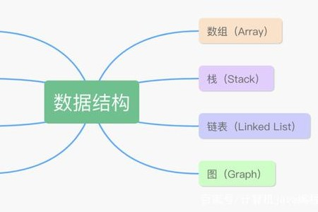

> ### 你为什么不亲自下船，
>
> ### 就一次也好啊，
>
> ### 亲眼去看看这个世界。
>
> 

------

## 

------

**目录**

[你为什么不亲自下船，](#t1)

[就一次也好啊，](#t2)

[亲眼去看看这个世界。](#t3)

[关于HTML5：](#t4)

[关于CSS：](#t5)

[关于JavaScript：](#t6)

[一、🌎前言：](#t7)

[二、🔖网页描述](#t8)

[三、📚网站介绍](#t9)

[四、💠网站演示](#t10)

[📜登陆页面设计](#t11)

[📜注册页面设计](#t12)

[📜首页页面设计](#t13)

[📜CSDN跳转设计](#t14)

[📜评论页面设计](#t15)

[📜 动态页面设计编辑](#t16)

[📜留言板页面设计](#t17)

[📜管理页面设计](#t18)

[五、⚙️ 网站代码](#t19)

[🌙部分代码样例，获取源码请 —> 关 注 ↓公 Z 号 获取更多源码 !](#t20)

[index.html](#t21)

[login.html ](#t22)

[register.html](#t23)

[六、获取代码](#t24)

[七、🥇 如何让学习不再盲目](#t25)

[结语：](#t26)

[获取源码？私信？关注？点赞？收藏？](#t27)

------


## 关于HTML5：


HTML5是Web中核心语言HTML的规范，用户使用任何手段进行网页浏览时看到的内容原本都是HTML格式的，在浏览器中通过一些技术处理将其转换成为了可识别的信息。HTML5在从前HTML4.01的基础上进行了一定的改进，虽然技术人员在开发过程中可能不会将这些新技术投入应用，但是对于该种技术的新特性，[网站开发](https://so.csdn.net/so/search?q=网站开发&spm=1001.2101.3001.7020)技术人员是必须要有所了解的。

------


## 关于CSS：


**CSS** (Cascading Style Sheets，层叠样式表），是一种用来为结构化文档（如 HTML 文档或 XML 应用）添加样式（字体、间距和颜色等）的计算机语言，**CSS** 文件扩展名为 .css。

通过使用 **CSS** 我们可以大大提升[网页开发](https://so.csdn.net/so/search?q=网页开发&spm=1001.2101.3001.7020)的工作效率！

- CSS 指层叠样式表 (**C**ascading **S**tyle **S**heets)
- 样式定义**如何显示** HTML 元素
- 样式通常存储在**样式表**中
- 把样式添加到 HTML 4.0 中，是为了**解决内容与表现分离的问题**
- **外部样式表**可以极大提高工作效率
- 外部样式表通常存储在 **CSS 文件**中
- 多个样式定义可**层叠**为一个

------


## 关于JavaScript：


JavaScript 编程语言允许你在 Web 页面上实现复杂的功能。如果你看到一个网页不仅仅显示静态的信息，而是显示依时间更新的内容，或者交互式地图，或者 2D/3D 动画图像，或者滚动的[视频播放器](https://so.csdn.net/so/search?q=视频播放器&spm=1001.2101.3001.7020)，等等——你基本可以确定，这需要 JavaScript 的参与。

------


## 一、🌎前言：


JavaScript课程期末作业，👨‍🎓学生HTML动态网页基础水平制作，页面排版干净简洁。模仿博客设计风格，精简优化，使用 HTML+CSS+JavaScript 页面布局设计,大学生网页设计作业源码Web，画面精明，排版整洁，内容丰富，主题鲜明，适合初学者、大学生、期末综合作业实践等学习使用, 实例全面，有助于同学的学习，本文将详细介绍如何从头开始设计个人网站并将其转换为代码的过程来实践设计，思路+过程+代码。

**一直走在路上🏔**

------


## 二、🔖网页描述


🏷️HTML综合实践作业，采用DIV+CSS+JavaScript+JQuery布局，包含多个页面，排版整洁，内容丰富，主题鲜明。

首页使用 CSS+JavaScript 排版比较丰富，色彩鲜明有活力，导航与正文字体分别设置不同字号大小。

设置了背景图，侧边栏，底边框等页面设计

子页面有纯文字页面和图文并茂页面。


> **🏅 一套优质的💯网页设计应该包含 (具体可根据个人要求而定)**

- 页面分为页头、菜单导航栏（最好可下拉）、中间内容板块、页脚四大部分。
- 
- 所有页面相互超链接，可到二三级页面，有多页面组成。
- 
- 页面样式风格统一布局显示正常，不错乱，使用Div+Css技术。
- 
- 菜单美观、醒目，二级菜单可正常弹出与跳转。
- 
- 可选有JS特效，如定时切换和手动切换图片轮播。
- 
- 页面中有多媒体元素，如gif、视频、音乐，表单技术的使用。
- 
- 页面清爽、美观、大方，不雷同。 
- 
- 不仅要能够把用户要求的内容呈现出来，还要满足布局良好、界面美观、配色优雅、表现形式多样等要求。

------


## 三、📚网站介绍


📔网站布局方面：计划采用目前主流的、能兼容各大主流浏览器、显示效果稳定的浮动网页布局结构。

📓网站程序方面：计划采用最新的网页编程语言 HTML5+CSS3+JavaScript 程序语言完成网站的功能设计。并确保网站代码兼容目前市面上所有的主流浏览器，已达到打开后就能即时看到网站的效果。

📘网站素材方面：计划收集各大平台好看的图片素材，并精挑细选适合网页风格的图片，然后使用PS做出适合网页尺寸的图片。

📒网站文件方面：网站系统文件种类包含：HTML网页结构文件、CSS网页样式文件、JavaScript网页特效文件、images网页图片文件；

📙网页编辑方面：网页作品代码简单，可使用任意HTML编辑软件（如：Dreamweaver、HBuilder、Vscode 、Sublime 、Webstorm、Text 、Notepad++ 等任意html编辑软件进行运行及修改编辑等操作）。
其中：

1. 📑 html 文件包含：其中index.html是首页、其他html为二级页面；
2. 📑 css 文件包含：css全部页面样式、文字滚动,、图片放大等；
3. 📄 js 文件包含：js 实现动态轮播特效、 表单提交,、点击事件等等；
4. 📄 images 文件包含：背景图片、插图等等；

------

##  四、💠网站演示


### 📜登陆页面设计

> 用户名：root
>
> 密码：root
>
> 1. 可根据自己需求更改
> 2. 登录即可进入首页
> 3. 重置 reset
> 4. 注册页面

#### 

------


### 📜注册页面设计

> 1.  用户名，密码，姓名，手机号……
> 2. 使用了JavaScript进行了限制即提示
> 3. 正则表达式
> 4. 表单元素
> 5. 验证码


------


### 📜首页页面设计

> 1. 内容丰富页面
> 2. 雪花动态背景效果
> 3. 背景图，图片，输入框，侧边栏
> 4. 特效点击效果
> 5. 背景音乐
> 6. 链接博客园首页，随笔
> 7. 评论 
> 8. 动态页面  
> 9. 管理  404特效
> 10. 留言板 
> 11. 退出  返回登陆页面
> 12. 根据需求更改优化
>      


------


### 📜CSDN跳转设计


------


### 📜评论页面设计


------


### 📜 动态页面设计

------


### 📜留言板页面设计


------


### 📜管理页面设计


------


## 五、⚙️ 网站代码


### 🌙部分代码样例，获取源码请 —> **关 注 ↓公 Z 号** 获取更多源码 !

> #### index.html

```html
<!DOCTYPE html>


<html lang="zh">


  <head>


    <meta charset="UTF-8" />


    <meta name="viewport" content="width=device-width, initial-scale=1.0" />


    <title>登陆页面</title>


    <link rel="stylesheet" href="css/index.css" />


  </head>


 


  <body>


    <script>


      console.log("Hello Enovo飞鱼开发!");


      console.log("Chris.@163.com");


    </script>


    <div class="htmleaf-container">


      <div class="wrapper">


        <div class="container">


          <h1 id="h"></h1>


          <form class="form">


            <input


              id="userName"


              name="userName"


              type="text"


              placeholder="用户名"


            />


            <input id="pwd" name="pwd" type="password" placeholder="密码" />


            <button type="submit" id="login-button">登录</button><br /><br />


            <button type="reset" id="login-button">重置</button><br /><br />


            <button type="submit" id="login-button" onclick="Re()">注册</button>


          </form>


        </div>


 


        <ul class="bg-bubbles">


          <li></li>


          <li></li>


          <li></li>


          <li></li>


          <li></li>


          <li></li>


          <li></li>


          <li></li>


          <li></li>


          <li></li>


        </ul>


      </div>


    </div>


    <script>


      function Re() {


        window.open("register.html");


      }


    </script>


    <script src="js/jquery-3.6.0.min.js"></script>


    <script src="js/verification.js"></script>


  </body>


</html>
```


> #### login.html 

```html
<!DOCTYPE html PUBLIC "-//W3C//DTD XHTML 1.0 Transitional//EN" "http://www.w3.org/TR/xhtml1/DTD/xhtml1-transitional.dtd">


<html xmlns="http://www.w3.org/1999/xhtml">


  <head>


    <meta http-equiv="Content-Type" content="text/html; charset=utf-8" />


    <title>Enovo首页</title>


    <meta name="Keywords" content="" />


    <meta name="Description" content="" />


    <link href="css/login.css" rel="stylesheet" />


    <!--[if lt IE 9]>


      <script src="js/modernizr.js"></script>


    <![endif]-->


  </head>


  <body>


    <script>


      console.log("Hello Enovo开发!");


      console.log("https://blog.csdn.net/m0_63244368?type=blog");


    </script>


    <header>


      <h1><a href="/">蓝精灵伙伴设计</a></h1>


      <p>


        世界上只有一种真正的英雄主义，就是在认清生活的真相后，仍然热爱生活！....


      </p>


    </header>


    <div class="navswf">


      <div id="nav">


        <ul>


          <li>


            <a href="https://blog.csdn.net/m0_63244368?spm=1019.2139.3001.5343">


              CSDN</a


            >


          </li>


          <li><a href="#" target="_blank" title="首页">首页</a></li>


          <li>


            <a


              href="https://blog.csdn.net/m0_63244368?spm=1019.2139.3001.5343"


              target="_blank"


              title="新随笔"


              >新随笔</a


            >


          </li>


 


          <li>


            <a href="contact.html" target="_blank" title="评论">评论</a>


          </li>


          <li>


            <a href="Dynamic.html" target="_blank" title="动态">动态</a>


          </li>


          <li>


            <a href="Management.html" target="_blank" title="管理">管理</a>


          </li>


          <li>


            <a href="Message.html" target="_blank" title="留言版">留言版</a>


          </li>


          <li>


            <a href="index.html" target="_blank" title="退出">退出</a>


          </li>


        </ul>


        <script src="js/silder.js"></script>


        <!--获取当前页导航 高亮显示标题-->


      </div>


    </div>


    <p>&nbsp;</p>


    <p>&nbsp;</p>


    <p>&nbsp;</p>


    <p>&nbsp;</p>


    <p>&nbsp;</p>


    <p>&nbsp;</p>


    <div class="blank"></div>


    <article>


      <div class="content">


        <div class="bloglist">


          <!--article begin-->


          <ul>


            <h2>


              <a


                title="Web之路，经历了心酸之后"


                href="webroad.html"


                target="_blank"


                >Web之路，经历了心酸之后</a


              >


            </h2>


            <p>


              清理电脑里的时候，看到以前专业课的作业。看修改日期有一个压缩包是去年的，一年的时间就这样过去了，这一年的学习成果就是这电脑里面的六个压缩包。


            </p>


            <p>


              “什么是母校？母校就是那个你一天骂他八遍却不许别人骂一遍的地方”当听到不少学弟学妹在抱怨学校差的时候，至今我也没后悔过，因为我经历了我认为最苦的那一段时期。


            </p>


            <figure></figure>


            <p>&nbsp;</p>


            <p class="dateview">


              <span>2022-11-29</span><span>作者：Chris.</span


              ><span>分类：<a href="/" target="_blank">心得笔记</a></span


              ><span>阅读❤(229)</span><span>评论✉(124)</span> 赞👍(111)


            </p>


          </ul>


          <ul>


            <h2>


              <a


                title="任何一个伟大的思想，都有一个微不足道的开始。"


                href="/"


                target="_blank"


                >任何一个伟大的思想，都有一个微不足道的开始。</a


              >


            </h2>


            <h3>


              &nbsp;&nbsp;&nbsp;&nbsp;&nbsp;&nbsp;&nbsp;【P1001】A+B Problem


            </h3>


            <p>


              题目描述 输入两个整数 a, ba,b，输出它们的和（|a|,|b| \le


              {10}^9∣a∣,∣b∣≤109）。 注意 Pascal 使用 integer 会爆掉哦！


              有负数哦！ C/C++ 的 main 函数必须是 int 类型，而且 C 最后要 return


              0。这不仅对洛谷其他题目有效，而且也是 NOIP/CSP/NOI 比赛的要求！


              好吧，同志们，我们就从这一题开始，向着大牛的路进发。 输入格式


              两个以空格分开的整数。 输出格式 一个整数。 输入输出样例 输入 #1 20


              30 输出 #1 50


            </p>


            <p></p>


            <pre>


        #include<bits/stdc++.h>


        using namespace std;


        int main(){


      	  int n,m,sum=0;


      	  cin >> n >> m;


      	  sum=n+m;


      	  cout << sum;


        }


              </pre


            >


            <figure></figure>


            <p>&nbsp;</p>


            <p class="dateview">


              <span>2022-11-29</span><span>作者：Chris.</span


              ><span>分类：<a href="/" target="_blank">程序人生</a></span


              ><span>阅读❤(229)</span><span>评论✉(124)</span> 赞👍(182)


            </p>


          </ul>


          <!--article end-->


        </div>


      </div>


      <aside class="navsidebar">


        <h2><p>个人档案</p></h2>


        <div class="vcard">


          <p class="fn">姓名：A.热爱</p>


          <p class="nickname">网名：Chris.</p>


          <p class="url">邮箱：2085******@qq.com</p>


          <p class="address">现居：长春市</p>


          <p class="role">职业：网站设计、网站制作</p>


        </div>


        <h2><p>搜索</p></h2>


        <div class="vcard">


          <p>


            <input type="text" />


            &nbsp;


            <input onclick="z1()" type="button" value="找找看" />


          </p>


          <p>&nbsp;</p>


          <p>


            <input type="text" />


            &nbsp;


            <input onclick="baidu()" type="button" value="百度搜索" />


          </p>


        </div>


        <h2><p>博客分类</p></h2>


        <ul class="news">


          <li><a href="/">技术栈(78)</a></li>


          <li><a href="/">程序人生(25)</a></li>


          <li><a href="/">心得笔记(39)</a></li>


        </ul>


        <h2><p>近期文章</p></h2>


        <ul class="news">


          <li><a href="/">女孩都有浪漫的小情怀</a></li>


          <li><a href="/">也许下个路口就会遇见希望</a></li>


          <li><a href="/">javascript程序设计基础</a></li>


          <li><a href="/">数据结构C算法</a></li>


          <li><a href="/">为了一个不存在的梦，执念了那么多年</a></li>


          <li><a href="/">职业生涯规划书</a></li>


        </ul>


        <h2><p>文章归档</p></h2>


        <ul class="news">


          <li><a href="/">2022年三月</a></li>


          <li><a href="/">2022 年四月</a></li>


          <li><a href="/">2022 年六月</a></li>


        </ul>


        <h2><p>友情链接</p></h2>


        <ul class="news">


          <li>


            <a href="https://blog.csdn.net/m0_63244368?type=blog"


              >A.热爱 个人博客</a


            >


          </li>


        </ul>


      </aside>


    </article>


    <div id="copright">Design by <a href="/" target="_blank">Chris.</a></div>


    <p>&nbsp;</p>


    <p>&nbsp;</p>


    <p>&nbsp;</p>


    <div align="center">


      <a


        target="_blank"


        rel="noopener noreferrer"


        href="https://zhuanlan.zhihu.com"


        color="#a0a0a0"


        >Enovo专栏</a


      ><a


        target="_blank"


        rel="noopener noreferrer"


        href="/roundtable"


        color="#a0a0a0"


        >圆桌</a


      ><a target="_blank" rel="noopener noreferrer" href="/explore">发现</a


      ><a target="_blank" rel="noopener noreferrer" href="/app">移动应用</a


      ><a target="_blank" rel="noopener noreferrer" href="/contact">联系我们</a


      ><a


        target="_blank"


        rel="noopener noreferrer"


        href="https://app.mokahr.com/apply/zhihu"


        >来Enovo工作</a


      ><a target="_blank" rel="noopener noreferrer" href="/org/signup"


        >注册机构号</a


      ><a target="_blank" rel="noopener noreferrer" href="//ir.zhihu.com"


        >Investor Relations</a


      >


    </div>


    <div class="ZhihuRights" align="center">


      <span>© 2022 Enovo</span


      ><a


        target="_blank"


        rel="noopener noreferrer"


        href="https://tsm.miit.gov.cn/dxxzsp/"


        >豫 ICP 证 101* 号</a


      ><a


        target="_blank"


        rel="noopener noreferrer"


        href="https://beian.miit.gov.cn/"


        >豫 ICP 备 1*50 号 - 1</a


      ><a


        target="_blank"


        rel="noopener noreferrer"


        href="http://www.beian.gov.cn/portal/registerSystemInfo?recordcode=11010802020088"


        >豫公网安备 110******0088 号</a


      ><a


        target="_blank"


        rel="noopener noreferrer"


        href="https://www.zhihu.com/certificates"


        >豫网文[2022]2**4-81 号</a


      ><a


        href="https://pic4.zhimg.com/v2-69619662ff377c3741d92bb6fd46b7ca.png"


        target="_blank"


        rel="noopener noreferrer"


        >出版物经营许可证</a


      >


    </div>


    <div align="center">


      <a


        target="_blank"


        rel="noopener noreferrer"


        href="https://zhuanlan.zhihu.com/p/28852607"


        >侵权举报</a


      ><a target="_blank" rel="noopener noreferrer" href="http://www.12377.cn"


        >网上有害信息举报专区</a


      ><a target="_blank" rel="noopener noreferrer" href="/term/child-jubao"


        >儿童色情信息举报专区</a


      ><a


        target="_blank"


        rel="noopener noreferrer"


        href="/term/algorithm-recommend-report"


        >互联网算法推荐举报专区违法和不良信息举报：010-82716601</a


      >


      <a href="mailto:jubao@zhihu.com">举报邮箱：jubao@Chris.com</a>


    </div>


    <div class="css-1xaekgw">


      


    </div>


  </body>


</html>


<script>


  function baidu() {


    window.open("https://www.baidu.com/");


  }


  function z1() {


    window.open("/");


  }


</script>


<div id="page_end_html">


  <!--live2d-->


  <script src="https://blog-static.cnblogs.com/files/zouwangblog/autoload.js"></script>


  <!--live2dend-->


 


  <!--放大图片-->


  <link


    rel="stylesheet"


    type="text/css"


    href="https://blog-static.cnblogs.com/files/zouwangblog/zoom.css"


  />


  <script src="https://cdn.bootcss.com/jquery/1.8.3/jquery.min.js"></script>


  <script src="https://cdn.bootcss.com/bootstrap/3.2.0/js/transition.js"></script>


  <script src="https://blog-static.cnblogs.com/files/zouwangblog/zoom.js"></script>


  <script type="text/javascript">


    $("#cnblogs_post_body img").attr("data-action", "zoom");


  </script>


  <!--放大图片end-->


 


  <!--鼠标特效-->


  <script src="https://blog-static.cnblogs.com/files/zouwangblog/mouse-click.js"></script>


  <canvas


    width="1777"


    height="841"


    style="


      position: fixed;


      left: 0px;


      top: 0px;


      z-index: 2147483647;


      pointer-events: none;


    "


  ></canvas>


  <!--鼠标特效 end-->


  <!-- 友链 -->


  <input id="linkListFlg" type="hidden" />


 


  <!-- require APlayer -->


  <link


    rel="stylesheet"


    href="https://cdn.jsdelivr.net/npm/aplayer/dist/APlayer.min.css"


  />


  <script src="https://cdn.jsdelivr.net/npm/aplayer/dist/APlayer.min.js"></script>


  <!-- require MetingJS -->


  <script src="https://cdn.jsdelivr.net/npm/meting@2/dist/Meting.min.js"></script>


  <meting-js


    id="2829883282"


    lrc-type="0"


    server="netease"


    order="random"


    type="playlist"


    fixed="true"


    autoplay="false"


    list-olded="true"


  >


  </meting-js>


 


  <!-- // 随机线条 -->


  <script>


    !(function () {


      function n(n, e, t) {


        return n.getAttribute(e) || t;


      }


      function e(n) {


        return document.getElementsByTagName(n);


      }


      function t() {


        var t = e("script"),


          o = t.length,


          i = t[o - 1];


        return {


          l: o,


          z: n(i, "zIndex", -1),


          o: n(i, "opacity", 0.6),


          c: n(i, "color", "148,0,211"),


          n: n(i, "count", 99),


        };


      }


      function o() {


        (a = m.width =


          window.innerWidth ||


          document.documentElement.clientWidth ||


          document.body.clientWidth),


          (c = m.height =


            window.innerHeight ||


            document.documentElement.clientHeight ||


            document.body.clientHeight);


      }


      function i() {


        r.clearRect(0, 0, a, c);


        var n, e, t, o, m, l;


        s.forEach(function (i, x) {


          for (


            i.x += i.xa,


              i.y += i.ya,


              i.xa *= i.x > a || i.x < 0 ? -1 : 1,


              i.ya *= i.y > c || i.y < 0 ? -1 : 1,


              r.fillRect(i.x - 0.5, i.y - 0.5, 1, 1),


              e = x + 1;


            e < u.length;


            e++


          )


            (n = u[e]),


              null !== n.x &&


                null !== n.y &&


                ((o = i.x - n.x),


                (m = i.y - n.y),


                (l = o * o + m * m),


                l < n.max &&


                  (n === y &&


                    l >= n.max / 2 &&


                    ((i.x -= 0.03 * o), (i.y -= 0.03 * m)),


                  (t = (n.max - l) / n.max),


                  r.beginPath(),


                  (r.lineWidth = t / 2),


                  (r.strokeStyle = "rgba(" + d.c + "," + (t + 0.2) + ")"),


                  r.moveTo(i.x, i.y),


                  r.lineTo(n.x, n.y),


                  r.stroke()));


        }),


          x(i);


      }


      var a,


        c,


        u,


        m = document.createElement("canvas"),


        d = t(),


        l = "c_n" + d.l,


        r = m.getContext("2d"),


        x =


          window.requestAnimationFrame ||


          window.webkitRequestAnimationFrame ||


          window.mozRequestAnimationFrame ||


          window.oRequestAnimationFrame ||


          window.msRequestAnimationFrame ||


          function (n) {


            window.setTimeout(n, 1e3 / 45);


          },


        w = Math.random,


        y = { x: null, y: null, max: 2e4 };


      (m.id = l),


        (m.style.cssText =


          "position:fixed;top:0;left:0;z-index:" + d.z + ";opacity:" + d.o),


        e("body")[0].appendChild(m),


        o(),


        (window.onresize = o),


        (window.onmousemove = function (n) {


          (n = n || window.event), (y.x = n.clientX), (y.y = n.clientY);


        }),


        (window.onmouseout = function () {


          (y.x = null), (y.y = null);


        });


      for (var s = [], f = 0; d.n > f; f++) {


        var h = w() * a,


          g = w() * c,


          v = 2 * w() - 1,


          p = 2 * w() - 1;


        s.push({ x: h, y: g, xa: v, ya: p, max: 6e3 });


      }


      (u = s.concat([y])),


        setTimeout(function () {


          i();


        }, 100);


    })();


  </script>


 


  <!-- 雪花特效 -->


  <script type="text/javascript">


    (function ($) {


      $.fn.snow = function (options) {


        var $flake = $('<div id="snowbox" />')


            .css({ position: "absolute", "z-index": "9999", top: "-50px" })


            .html("❄"),


          documentHeight = $(document).height(),


          documentWidth = $(document).width(),


          defaults = {


            minSize: 10,


            maxSize: 20,


            newOn: 1000,


            flakeColor:


              "#00CED1" /* 此处可以定义雪花颜色，若要白色可以改为#FFFFFF */,


          },


          options = $.extend({}, defaults, options);


        var interval = setInterval(function () {


          var startPositionLeft = Math.random() * documentWidth - 100,


            startOpacity = 0.5 + Math.random(),


            sizeFlake = options.minSize + Math.random() * options.maxSize,


            endPositionTop = documentHeight - 200,


            endPositionLeft = startPositionLeft - 500 + Math.random() * 500,


            durationFall = documentHeight * 10 + Math.random() * 5000;


          $flake


            .clone()


            .appendTo("body")


            .css({


              left: startPositionLeft,


              opacity: startOpacity,


              "font-size": sizeFlake,


              color: options.flakeColor,


            })


            .animate(


              {


                top: endPositionTop,


                left: endPositionLeft,


                opacity: 0.2,


              },


              durationFall,


              "linear",


              function () {


                $(this).remove();


              }


            );


        }, options.newOn);


      };


    })(jQuery);


    $(function () {


      $.fn.snow({


        minSize: 5 /* 定义雪花最小尺寸 */,


        maxSize: 80 /* 定义雪花最大尺寸 */,


        newOn: 200 /* 定义密集程度，数字越小越密集 */,


      });


    });


  </script>


</div>
```


> #### register.html

```html
<!DOCTYPE html>


<html lang="en">


  <head>


    <meta charset="UTF-8" />


    <title>注册页面</title>


    <style>


      body {


        /* background: url("images/top.jpg") no-repeat; */


        width: 100%;


        height: 100%;


        background-size: 160% 160%;


      }


      .rg_layout {


        background: #7bbc9a;


        background: -webkit-linear-gradient(top left, #7bbc9a 0%, #7bbc9a 100%);


        background: linear-gradient(to bottom right, #7bbc9a 0%, #7bbc9a 100%);


        background-color: rgba(255, 255, 255, 0.9);


        position: absolute;


        top: 0;


        left: 0;


        width: 100%;


        height: 100%;


        overflow: hidden;


      }


      .rg_left {


        float: left;


        margin: 30px;


      }


      .rg_center {


        float: left;


      }


      .rg_right {


        float: right;


        margin: 15px;


      }


      .rg_left > p:first-child {


        color: white;


        font-size: 30px;


      }


      .rg_left > p:last-child {


        color: white;


        font-size: 30px;


      }


      .rg_right > p:first-child {


        font-size: 20px;


      }


      .rg_right p {


        color: white;


      }


      .rg_right p a {


        color: white;


      }


      .td_left {


        width: 100px;


        height: 45px;


        text-align: right;


      }


      .td_right {


        padding-left: 50px;


      }


      #username,


      #password,


      #email,


      #name,


      #tel,


      #birthday,


      #checkcode,


      #password2 {


        width: 251px;


        height: 32px;


        border: 1px solid #a6a6a6;


        border-radius: 5px;


        padding-left: 10px;


      }


      #checkcode {


        width: 110px;


      }


      #img_check {


        height: 32px;


        vertical-align: middle;


      }


      #btn_sub {


        width: 270px;


        height: 40px;


        background-color: #ffffff;


        border: 1px solid #ffffff;


        font-size: 18px;


        margin-top: 30px;


        -webkit-appearance: none;


        -moz-appearance: none;


        appearance: none;


        outline: 0;


        border-radius: 3px;


        padding: 10px 15px;


        display: block;


        text-align: center;


        font-family: "Microsoft YaHei";


        -webkit-transition-duration: 0.25s;


        transition-duration: 0.25s;


      }


      .error {


        color: red;


      }


      #td_sub {


        padding-left: 150px;


      }


    </style>


    <script>


      window.onload = function () {


        document.getElementById("form").onsubmit = function () {


          return (


            checkUsername() &&


            checkPassword() &&


            checkPassword2() &&


            checkEmail() &&


            checkName() &&


            checkTel() &&


            checkCode()


          );


        };


        document.getElementById("username").onblur = checkUsername;


        document.getElementById("password").onblur = checkPassword;


        document.getElementById("password2").onblur = checkPassword2;


        document.getElementById("email").onblur = checkEmail;


        document.getElementById("name").onblur = checkName;


        document.getElementById("tel").onblur = checkTel;


        document.getElementById("checkcode").onblur = checkCode;


      };


      function checkUsername() {


        var username = document.getElementById("username").value;


        var reg_username = /^\w{6,12}$/;


        var flag = reg_username.test(username);


        var s_username = document.getElementById("s_username");


        if (flag) {


          s_username.innerHTML =


            "";


        } else {


          alert("请输入用户名(6-12位英文单词)");


          s_username.innerHTML = "*用户名格式有误";


        }


        return (flag = false);


      }


      function checkPassword() {


        var password = document.getElementById("password").value;


        var reg_password = /^\w{6,12}$/;


        var flag = reg_password.test(password);


        var s_password = document.getElementById("s_password");


        if (flag) {


          s_password.innerHTML =


            "";


        } else {


          alert("请输入密码(6-12位含有英文字母以及数字的密码)");


          s_password.innerHTML = "*请输入密码";


        }


        return flag;


      }


      function checkPassword2() {


        if (


          (password2 =


            document.getElementById("password2").value ==


            document.getElementById("password").value)


        ) {


          s_password.innerHTML =


            "";


        } else {


          alert("两次输入密码不一致,请认真核对！");


          s_password.innerHTML = "*请重复输入密码";


        }


        return flag;


      }


      function checkEmail() {


        var email = document.getElementById("email").value;


        var reg_email = / /;


        var flag = reg_email.test(email);


        var s_email = document.getElementById("s_email");


        if ((email = document.getElementById("email").value == "")) {


          alert("请输入邮箱");


          s_email.innerHTML = "*请输入邮箱";


        } else {


          s_email.innerHTML =


            "";


        }


        return flag;


      }


      function checkName() {


        if ((name = document.getElementById("name").value == "")) {


          alert("请输入姓名");


          s_name.innerHTML = "*请输入姓名";


        } else {


          s_name.innerHTML =


            "";


        }


        return flag;


        console.log(flag);


      }


      function checkTel() {


        var tel = document.getElementById("tel").value;


        var reg_tel = /^1[34578]\d{9}$/;


        var flag = reg_tel.test(tel);


        var s_tel = document.getElementById("s_tel");


        if (flag) {


          s_tel.innerHTML =


            "";


        } else {


          alert("请输入11位有效手机号");


          s_tel.innerHTML = "*请输入11位有效手机号";


        }


        return flag;


      }


      function checkCode() {


        var checkcode = document.getElementById("checkcode").value;


        var reg_checkcode = / /;


        var flag = reg_checkcode.test(checkcode);


        var s_checkcode = document.getElementById("s_checkcode");


        if ((checkcode = document.getElementById("checkcode").value == "")) {


          alert("请输入验证码");


        }


        return flag;


      }


    </script>


  </head>


  <body>


    <script>


      console.log("Hello Enovo开发!");


      console.log("https://blog.csdn.net/m0_63244368?type=blog");


    </script>


    <div class="rg_layout">


      <div class="rg_left">


        <p>新用户注册</p>


        <p>USER REGISTER</p>


      </div>


      <div class="rg_center">


        <div class="rg_form">


          <form action="#" id="form" method="get">


            <table>


              <tr>


                <td class="td_left"><label for="username">用户名</label></td>


                <td class="td_right">


                  <input


                    type="text"


                    name="username"


                    id="username"


                    placeholder="请输入用户名"


                  />


                  <span id="s_username" class="error"></span>


                </td>


              </tr>


              <tr>


                <td class="td_left"><label for="password">密码</label></td>


                <td class="td_right">


                  <input


                    type="password"


                    name="password"


                    id="password"


                    placeholder="请输入密码"


                  />


                  <span id="s_password" class="error"></span>


                </td>


              </tr>


              <tr>


                <td class="td_left"><label for="password2">确认密码</label></td>


                <td class="td_right">


                  <input


                    type="password"


                    name="password2"


                    id="password2"


                    placeholder="请确认密码"


                  />


                  <span id="s_password2" class="error"></span>


                </td>


              </tr>


              <tr>


                <td class="td_left"><label for="email">Email</label></td>


                <td class="td_right">


                  <input


                    type="email"


                    name="email"


                    id="email"


                    placeholder="请输入邮箱"


                  />


                  <span id="s_email" class="error"></span>


                </td>


              </tr>


              <tr>


                <td class="td_left"><label for="name">姓名</label></td>


                <td class="td_right">


                  <input


                    type="text"


                    name="name"


                    id="name"


                    placeholder="请输入姓名"


                  />


                  <span id="s_name" class="error"></span>


                </td>


              </tr>


              <tr>


                <td class="td_left"><label for="tel">手机号</label></td>


                <td class="td_right">


                  <input


                    type="text"


                    name="tel"


                    id="tel"


                    placeholder="请输入手机号"


                  />


                  <span id="s_tel" class="error"></span>


                </td>


              </tr>


              <tr>


                <td class="td_left"><label>性别</label></td>


                <td class="td_right">


                  <input type="radio" name="gender" value="male" checked /> 男


                  <input type="radio" name="gender" value="female" /> 女


                </td>


              </tr>


              <tr>


                <td class="td_left"><label for="birthday">出生日期</label></td>


                <td class="td_right">


                  <input


                    type="date"


                    name="birthday"


                    id="birthday"


                    placeholder="请输入出生日期"


                  />


                </td>


              </tr>


              <tr>


                <td class="td_left"><label for="checkcode">验证码</label></td>


                <td class="td_right">


                  <input


                    type="text"


                    name="checkcode"


                    id="checkcode"


                    placeholder="请输入验证码"


                  />


                  <span id="s_checkcode" class="error"></span>


                  <!-- 验证码 -->


                </td>


              </tr>


              <p>&nbsp;</p>


              <p>&nbsp;</p>


              <tr>


                <td colspan="10" id="td_sub">


                  <input type="submit" id="btn_sub" value="注册" />


                </td>


              </tr>


            </table>


          </form>


        </div>


      </div>


      <div class="rg_right">


        <p>已有账号?<a href="index.html">立即登录</a></p>


      </div>


    </div>


  </body>


</html>
```

------

## 

## 六、获取代码


正确的代码文件及路径，见下图：


第一步，通过微信公众号下载源码压缩包，解压并打开文件夹，即为上图样式；

第二步，可以根据需求自定义背景文字；

第三步，点击 index.html 文件打开即可，左下角打开背景音乐；

以上就是我们此次期末时间大作业的全部内容了，是否精彩呢？如果有好的建议或者想法可以联系我，一起交流🙇‍；

------


## 七、🥇 如何让学习不再盲目


1. 入门期间不要盲目看太多书，找一本网上或身边有经验程序员推荐的教材，先系统的学习。
2. 多看帮助文档，帮助文档就像一个游戏的玩法说明通关秘籍，该看就看别太自信。
3. 菜鸟容易被对象、属性、方法等词汇迷惑？那是你连最基础知识都还没掌握。
4. 不要忽视没一个看起来不起眼的问题，经常总结做到举一反三。
5. 没积累足够知识和经验前，你是开发不出一个完整项目的。
6. 把最新技术挂在嘴边，还不如把过时技术牢记心中。
7. 活到老学到老，只有一招半式是闯不了江湖的。
8. 看得懂的书，仔细看；看不懂的书，硬着头皮也要看完。
9. 书读百遍其义自见，别指望读一遍就能掌握。
10. 请把教程里的例子亲手实践下，即使案例中有完整源码。
11. 把在教程中看到的有意义的例子扩充；并将其切实的运用到自己的工作中。
12. 不要漏掉教程中任何一个习题——请全部做完并做好笔记。
13. 水平是在不断的实践中完善和发展的，你与大牛差的只是经验的积累。
14. 每学到一个难点的时候，尝试对朋友或网上分享你的心得,让别人都能看得懂说明你真的掌握。
15. 做好保存源文件的习惯，这些都是你的知识积累。
16. 遇到问题不要张口就问，要学会自己找答案，比如google、百度和w3cschool上都有很多编程相关资料，你只要输入关键字就能找到你的答案。

------


## 结语：


> 上述内容就是此次期末综合实践作业的全部内容了，感谢大家的支持，相信在很多方面存在着不足乃至错误，希望可以得到大家的指正。🙇‍(ง •_•)ง

> **2023年第三十三期，**希望得到大家的喜欢🙇‍

> 希望大家有好的意见或者建议，欢迎私信

------


以上就是本篇文章的全部内容了

 **~ 关注我，点赞博文~ 每天带你涨知识!**

1.看到这里了就 [点赞+好评+收藏] 三连 支持下吧，你的「点赞，好评，收藏」是我创作的动力。

2.关注我 ~ 每天带你学习 :各种前端插件、3D炫酷效果、图片展示、文字效果、以及整站模板 、HTML模板 、C++、数据结构、Python程序设计、Java程序设计、爬虫等！ 「在这里有好多 开发者，一起探讨 前端 开发 知识，互相学习」！

3.以上内容技术相关问题可以相互学习，可 **关 注 ↓公 Z 号** 获取更多源码 !
 

## 获取源码？私信？关注？点赞？收藏？

> 👍+✏️+⭐️+🙇‍

有需要源码的小伙伴可以 关注下方微信公众号 **" Enovo开发工厂 "**🙇‍ 回复 **" boke-1 "**
